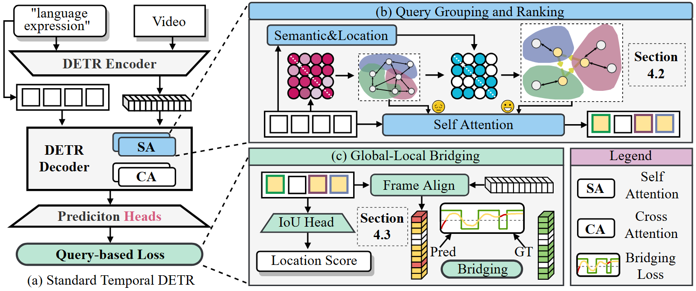

# [ICCV2025] Sim-DETR: Unlock DETR for Temporal Sentence Grounding

> **Experiment inventory.** A reconciled record of completed, diagnostic,
> interrupted, and running experiments is available in
> [EXPERIMENT_RESULTS.md](EXPERIMENT_RESULTS.md), with a
> [machine-readable snapshot](results/experiment_inventory_2026_09_01.json).
> It also documents metric provenance and prevents intermediate runs from being
> cited as final results.

## DQ-CGP V3 (D1) extension

This repository includes the complete DQ-CGP implementation for
QVHighlights. DQ-CGP performs candidate-specific temporal binding, basis
routing, and feature refinement for each native DETR query. The pre-designated
V3 release configuration inserts DQ-CGP once between decoder layers D1 and D2
and is trained from scratch under the same protocol as the Sim-DETR baseline.

- Complete training and evaluation guide: [sim_detr/dq_cgp/README.md](sim_detr/dq_cgp/README.md)
- Released checkpoint: [DQ-CGP V3 (D1) release](https://github.com/chinagalaxy2002/DQ-GCP-SD/releases/tag/v3-d1-qvhighlights)
- Within-run checkpoint selection: validation `MR-full-mAP`

### QVHighlights results

| Method | test R1@0.5 | test R1@0.7 | test mAP@0.5 | test mAP@0.75 | test mAP Avg. | val R1@0.5 | val R1@0.7 | val mAP@0.5 | val mAP@0.75 | val mAP Avg. |
| ------ | ----------: | ----------: | -----------: | ------------: | ------------: | ---------: | ---------: | ----------: | -----------: | -----------: |
| Sim-DETR baseline (standard evaluator) | 66.93 | **51.56** | 67.75 | 48.89 | 47.60 | **68.32** | 53.81 | **69.03** | 50.77 | 49.14 |
| **DQ-CGP V3 (D1)** | **67.96** | 51.36 | **68.94** | **49.01** | **48.06** | 67.81 | **54.06** | 68.81 | **51.01** | **49.66** |
| Improvement | +1.03 | -0.20 | +1.19 | +0.12 | **+0.46** | -0.51 | +0.25 | -0.22 | +0.24 | **+0.52** |

The causal attention-capture evaluator produces slightly different saved-test
values for the same baseline/DQ checkpoints (`47.58/48.04` MR mAP). Deltas
must be computed within one evaluation path; the two paths are documented in
the [consolidated experiment record](EXPERIMENT_RESULTS.md#evaluation-provenance).

The released V3 checkpoint was selected at epoch 103. Its main parameters are
seed 2017, `beta=0.05`, binding-loss coefficient `0.20`, routing-loss
coefficient `0.01`, 16 bases, and prompt length 6. Test metrics are computed
only after validation-based checkpoint selection using the local
`data/highlight_test_with_gt.jsonl` annotations.

The complete checkpoint is stored as one Git LFS object at
`checkpoints/model_best.ckpt`. Clone it together with the source and verify the
downloaded file:

```bash
git lfs install --local
git lfs pull
sha256sum checkpoints/model_best.ckpt
# cb0df35b25397e34b8da27e0dd9a266d4fca00c0584cfbd45b5be8639ebc3e19
```

### Candidate-Conditioned Semantic Calibration pilot

We also evaluated a late semantic residual that uses each final decoder
candidate's native temporal mask to pool video evidence before calibrating only
its foreground logit. The decoder, localization heads, IoU scores, matcher,
auxiliary outputs, and original losses remain unchanged.

| Validation method (seed 2017) | R1@0.5 | R1@0.7 | mAP@0.5 | mAP@0.75 | MR mAP |
| --- | ---: | ---: | ---: | ---: | ---: |
| Sim-DETR baseline | 68.32 | 53.81 | 69.03 | **50.77** | **49.14** |
| + Static semantic calibration | **68.52** | 53.35 | **69.25** | 50.33 | 48.95 |
| + Candidate-conditioned calibration | 67.81 | **54.52** | 68.78 | 50.20 | **49.14** |

The candidate-conditioned model matches the baseline. We further evaluated
roll-1/2/3, deterministic random derangement, farthest-context, uniform, and
static interventions on the same Full checkpoint, separately on all 1,550,
single-occurrence 1,020, and multi-occurrence 530 validation queries. All-query
MR mAP differs from aligned by at most `0.04`; multi-occurrence MR mAP differs
by at most `0.09`, and roll-3 is slightly higher rather than lower. The
expanded diagnosis therefore remains a No-Go: candidate-context
correspondence is not supported as the source of a retrieval improvement. See
the [complete implementation, logs, occurrence-stratified tables, and reproduction guide](results_semantic_calibration/README.md).

### Soccer-GMR: Candidate-Conditioned Semantic Calibration

The repository also contains an isolated CSC implementation for Soccer-GMR
Standard. It adds a late semantic residual after the native Sim-DETR decoder:

$$
p_i=\operatorname{masked\_softmax}(m_i^{native}),\quad
v_i=\sum_t p_i(t)F_t,\quad
e_i=\operatorname{LN}(e+g(e,v_i)),\quad
\ell_{i,fg}'=\ell_{i,fg}^{native}+\gamma\,\operatorname{cos}(q_i,e_i).
$$

Only the final foreground logit is calibrated. The native decoder, temporal
spans, masks, IoU scores, saliency, auxiliary outputs, matcher, and original
Sim-DETR files remain unchanged. The Soccer-GMR adapter additionally applies
null-aware candidate supervision because the dataset contains many null-set
queries. See the [complete Soccer-GMR method and reproduction guide](sim_detr/soccer_gmr_csc/README.md).

#### Soccer-GMR seed-2023 results

All three methods use the same `bsz=8`, `lr=5e-5`, `mask_loss_coef=6`, null-aware
loss settings, and seed 2023. Checkpoints are selected using validation mAP;
test labels are used only for the final evaluation.

| Method | Best val mAP | Test mAP | Test mR@1 | Test mR@3 | Test mR@5 | Test mIoU@1 |
| --- | ---: | ---: | ---: | ---: | ---: | ---: |
| Native Sim-DETR | 22.59 | 20.73 | 11.55 | 24.14 | 31.51 | 28.95 |
| Static semantic calibration | **24.30** | **21.09** | **12.41** | **24.49** | 31.10 | **31.45** |
| Candidate-conditioned calibration | 22.48 | 19.43 | 11.57 | 22.06 | 28.39 | 28.36 |

Static calibration improves over Native by `+0.36` test mAP. The Full model
does not exceed Static in this seed, so the experiment does not support an
additional candidate-conditioned semantic gain on Soccer-GMR.

#### Soccer-GMR Full-checkpoint counterfactuals

The following interventions modify only the context used by the Full semantic
residual while keeping native predictions fixed:

| Intervention | Test mAP | Test mR@1 | Test mR@3 | Test mR@5 |
| --- | ---: | ---: | ---: | ---: |
| aligned | 19.43 | 11.57 | 22.06 | 28.39 |
| roll-1 | 18.83 | 10.48 | 21.92 | 28.08 |
| roll-2 | 19.48 | 11.68 | 21.77 | 28.49 |
| roll-3 | 19.23 | 11.40 | 21.61 | 27.87 |
| random derangement | 19.02 | 10.86 | 21.62 | 28.26 |
| farthest context | 19.53 | 11.84 | 21.95 | 28.30 |
| uniform context | 19.34 | 11.40 | 22.08 | 28.35 |
| static semantics | 19.47 | 11.61 | 21.93 | 28.19 |
| native bypass | 19.38 | 11.42 | 22.08 | 28.28 |

The Full checkpoint shows only weak sensitivity to candidate-context
correspondence: roll-1 drops by `0.60` mAP, while the other interventions stay
close to aligned. The implementation and scripts are located in
`sim_detr/soccer_gmr_csc/` and `sim_detr/semantic_calibration/`, including:

```bash
# Launch Native, Static, and Full in tmux on two GPUs.
SOCCER_GMR_RUN_TAG=nullaware_maskloss6_bsz8 \
bash sim_detr/soccer_gmr_csc/scripts/train_all_tmux.sh 2023

# Evaluate Full with aligned/rolled/random/farthest/uniform/static/native controls.
bash sim_detr/soccer_gmr_csc/scripts/run_counterfactuals.sh \
  results_soccer_gmr_csc/full_nullaware_maskloss6_bsz8_seed2023/model_best.ckpt 0 test
```

### Completed Native Hungarian Binding control

We also completed a parameter-free control that supervises only Sim-DETR's
existing D1 query-to-video cross-attention. It uses the final D4 Hungarian
assignment and adds `0.5 * L_native_bind` during training, while retaining the
Vanilla Sim-DETR architecture and inference path.

| Split | Method | R1@0.5 | R1@0.7 | mAP@0.5 | mAP@0.75 | mAP Avg. |
| --- | --- | ---: | ---: | ---: | ---: | ---: |
| Validation | Sim-DETR baseline | 68.32 | 53.81 | 69.03 | 50.77 | 49.14 |
| Validation | NativeBind (`lambda=0.5`) | **69.16** | **54.39** | **70.03** | **50.88** | **49.67** |
| Test | Sim-DETR baseline | 66.86 | **51.56** | 67.70 | **48.70** | **47.58** |
| Test | NativeBind (`lambda=0.5`) | **67.06** | 51.10 | **67.85** | 48.07 | 47.25 |

On the 511 multi-occurrence test queries, D1 AEC improves from `0.6696` to
`0.8480` and D1 ECR falls from `0.3954` to `0.1490`, confirming that the loss
directly changes early occurrence ownership. The gain does not propagate to
D4, and headline test MR mAP decreases by `0.33`; this control is therefore a
mechanism result rather than a claimed test-MR improvement. See the
[full method, completed-run results, and paired reproduction commands](causal_occurrence_lab/NATIVE_BINDING_RESULTS.md).

The exact Baseline vs NativeBind training pair is launched with:

```bash
bash causal_occurrence_lab/scripts/run_native_binding_pair.sh
```

### Layer-Consistent Binding (LCB Acquire → Preserve)

We further provide the complete implementation of **Layer-Consistent Binding (LCB)** under the decoupled **Acquire → Preserve** framework:

$$\text{Acquire ownership at D1} \longrightarrow \text{Preserve ownership through D2–D4}$$

$$L = L_{\text{Sim-DETR}} + 0.5 \cdot L_{\text{D1-bind}} + 0.1 \cdot L_{\text{late-bind}} + 0.1 \cdot L_{\text{owner-cons}} + 0.1 \cdot L_{\text{drop}}$$

- **D1 Ownership Acquisition ($L_{\text{D1-bind}}$, $\lambda=0.5$)**: Matches the verified NativeBind signal for initial query-occurrence binding.
- **D2–D4 Direct Ownership Maintenance ($L_{\text{late-bind}}$, $\lambda=0.1$)**: Directly anchors subsequent layers to prevent losing the GT occurrence.
- **D1 → D2–D4 Ownership Consistency ($L_{\text{owner-cons}}$, $\lambda=0.1$)**: JS divergence on $\text{stopgrad}(p^{(1)})$ preventing occurrence identity drift.
- **Anti-Washout Protection ($L_{\text{drop}}$, $\lambda=0.1, \delta=0.05$)**: Hinge loss preventing matched occurrence attention mass decay.

- Detailed documentation: [Layeerconsistentbinding/README.md](Layeerconsistentbinding/README.md)
- Training script: `bash Layeerconsistentbinding/scripts/run_train_lcb.sh`
- Evaluation script: `bash Layeerconsistentbinding/scripts/run_eval_lcb.sh <checkpoint> <test_jsonl> <output_dir>`

#### LCB Full Results (seed 2017)

The `lcb_full` checkpoint was selected at epoch 144 using validation
MR-full-mAP (`49.19`). Test results were computed only after this
validation-based selection. The full, versioned artifact record—including the
configuration, logs, validation predictions, D1–D4 test submissions, and
ownership analysis—is available in
[`Layeerconsistentbinding/results/lcb_full_seed2017`](Layeerconsistentbinding/results/lcb_full_seed2017/).

| Split / final decoder layer | R1@0.5 | R1@0.7 | mAP@0.5 | mAP@0.75 | mAP Avg. | HL-min-Fair mAP / Hit@1 |
| --- | ---: | ---: | ---: | ---: | ---: | ---: |
| Validation / D4 | 68.13 | 53.35 | 69.13 | 50.82 | **49.19** | 77.55 / 79.74 |
| Test / D4 | 66.73 | 51.04 | 67.83 | 47.98 | 47.25 | 77.13 / 78.15 |

The test ownership analysis covers 1,542 records and 2,691 matched
trajectories. D1 → D4 persistence is `0.9788`, while the D1 → D4
washout-drop rate is `0.2404`.

### Exploratory DQ-CGP variants on test

| Method | R1@0.5 | R1@0.7 | mAP@0.5 | mAP@0.75 | mAP Avg. |
| --- | ---: | ---: | ---: | ---: | ---: |
| DQ-CGP V3 (D1) | **67.96** | 51.36 | **68.94** | **49.01** | **48.06** |
| Grid: beta=0.100, bind=0.40, route=0.005 | 66.80 | 51.23 | 67.48 | 48.96 | 47.88 |
| Grid: beta=0.100, bind=0.10, route=0.020 | 68.35 | **52.40** | 68.75 | 48.06 | 47.82 |
| Grid: beta=0.025, bind=0.10, route=0.005 | 66.93 | 51.62 | 67.89 | 48.31 | 47.68 |
| Grid: beta=0.100, bind=0.40, route=0.020 | 67.90 | 50.97 | 68.17 | 48.25 | 47.66 |
| Grid: beta=0.025, bind=0.40, route=0.005 | 67.25 | 52.01 | 67.90 | 48.20 | 47.63 |
| Grid: beta=0.025, bind=0.40, route=0.020 | 67.51 | 51.23 | 67.80 | 47.76 | 47.49 |
| Grid: beta=0.100, bind=0.10, route=0.005 | 66.93 | 49.94 | 67.59 | 47.90 | 47.40 |
| Grid: beta=0.025, bind=0.10, route=0.020 | 66.80 | 50.52 | 67.55 | 46.89 | 46.73 |
| DQ-CGP tied dual | 66.15 | 50.26 | 67.21 | 47.67 | 46.88 |
| DQ-CGP dual independent | 66.21 | 51.36 | 67.21 | 47.76 | 46.85 |
| DQ-CGP tied all | 66.21 | 49.81 | 67.30 | 47.10 | 46.80 |

These are post-training exploratory test comparisons: all nine completed grid
configurations were evaluated on the local test-with-GT split. The grid's
highest validation score is `50.02` for `beta=0.100, bind=0.40, route=0.005`,
whereas the pre-designated V3 configuration has the highest test MR mAP
(`48.06`). V3 should therefore not be described as the validation winner of
the later grid. Full validation and test values are listed in
[EXPERIMENT_RESULTS.md](EXPERIMENT_RESULTS.md#dq-cgp-screening-grid).

#### Inference-time beta sweep

Changing only the trained V3 checkpoint's residual coefficient gives val
MR-mAP `49.59/49.66/49.53/49.45` at beta `0/0.05/0.10/0.20`. A wider sweep
decreases from `49.16` at beta `0.5` to `47.20` at beta `3.0`. This is a
fixed-checkpoint sensitivity diagnostic, not independent retraining.

### Incomplete and running experiments

The QVHighlights two-layer LS-DQ-CGP run stopped after eight logged epochs; its
intermediate best val MR-mAP is `29.45`, with no test result. At the
2026-09-01 19:31 CST snapshot, the two-layer Soccer-GMR LS-DQ-CGP run was at
epoch 88 (best val mAP `18.23` at epoch 57). The two-layer Full CSC run using
D1-attention evidence plus binding 0.2 was at epoch 39 (best val mAP `15.97` at
epoch 37); its completed result is reported in the current-run section below.

by Jiajin Tang*, Zhengxuan Wei*, Yuchen Zhu, Cheng Shi, Guanbin Li, Liang Lin, Sibei Yang†

*Equal contribution; †Corresponding Author


[](https://arxiv.org/abs/2509.23867)

----------
## Abstract

Temporal sentence grounding aims to identify exact moments in a video that correspond to a given textual query, typically addressed with detection transformer (DETR) solutions. However, we find that typical strategies designed to enhance DETR do not improve, and may even degrade, its performance in this task. We systematically analyze and identify the root causes of this abnormal behavior: (1) conflicts between queries from similar target moments and (2) internal query conflicts due to the tension between global semantics and local localization. Building on these insights, we propose a simple yet powerful baseline, Sim-DETR, which extends the standard DETR with two minor modifications in the decoder layers: (1) constraining self-attention between queries based on their semantic and positional overlap and (2) adding query-to-frame alignment to bridge the global and local contexts. Experiments demonstrate that Sim-DETR unlocks the full potential of DETR for temporal sentence grounding, offering a strong baseline for future research.

----------
## Framework
<p align="center">
  
</p>

----------

## Prerequisites

### 0. Clone this repository

```
git clone https://github.com/SooLab/Sim-DETR.git
cd Sim-DETR
```

### 1. Prepare datasets
#### QVHighlights

We use video features (CLIP and SlowFast) and text features (CLIP) as inputs. For CLIP, we utilize the features extracted by [R2-Tuning](https://github.com/yeliudev/R2-Tuning) (from the last four layers), but we retain only the `[CLS]` token per frame to ensure efficiency. You can download our prepared feature files from [qvhighlights\_features](https://drive.google.com/drive/folders/1rRVID6OO5arVR1vL5SP5fcCFAJ35B-IK?usp=sharing) and unzip them to your data root directory.


### 2. Install dependencies

For Anaconda setup, refer to the official [Moment-DETR GitHub](https://github.com/jayleicn/moment_detr).

----------

## QVHighlights

### Training

Update `feat_root` in `sim_detr/scripts/train.sh` to the path where you saved the features, then run:

```bash
bash sim_detr/scripts/train.sh  
```


### Inference Evaluation and Codalab Submission

After training, you can generate `hl_val_submission.jsonl` and `hl_test_submission.jsonl` for validation and test sets by running:

```
bash sim_detr/scripts/inference.sh results/{direc}/model_best.ckpt 'val'
bash sim_detr/scripts/inference.sh results/{direc}/model_best.ckpt 'test'
```

Replace `{direc}` with the path to your saved checkpoint. For more details on submission, see [standalone_eval/README.md](standalone_eval/README.md).

----------

## Causal occurrence-binding experiments

The isolated [causal occurrence lab](causal_occurrence_lab/README.md) tests
whether candidate-specific temporal evidence binding is learned in Sim-DETR.
It includes D1--D4 native cross-attention capture, corrected occurrence
metrics, beta-zero/stripped equivalence checks, and single-seed causal control
training scripts. Published Phase-1 summaries, manifests, and smoke logs are in
[causal_occurrence_lab/results](causal_occurrence_lab/results/). Large raw
per-query records are intentionally kept out of the GitHub commit.

The delivered experiments use seed 2017 only; no multi-seed experiment is
included in the reported results. The fixed-seed first-round causal controls
and the 200-epoch NativeBind `lambda=0.5` run are complete. Incomplete
coefficient sweeps are excluded from the published result record.

----------

## Citation

If you find this repository useful, please cite our work:

```
@inproceedings{tang2025sim,
  title={Sim-DETR: Unlock DETR for Temporal Sentence Grounding},
  author={Tang, Jiajin and Wei, Zhengxuan and Zhu, Yuchen and Shi, Cheng and Li, Guanbin and Lin, Liang and Yang, Sibei},
  booktitle={Proceedings of the IEEE/CVF International Conference on Computer Vision},
  pages={22760--22771},
  year={2025}
}
```

----------

## License

The annotation files and parts of the implementation are borrowed from Moment-DETR and TR-DETR. Consequently, our code is also released under the [MIT License](https://opensource.org/licenses/MIT).

----------

## Latest Soccer-GMR LS-DQ-CGP supplement

This section supplements the original repository description above. The
two-layer Soccer-GMR LS-DQ-CGP implementation is isolated in
[`sim_detr/soccer_gmr_ls_dq_cgp`](sim_detr/soccer_gmr_ls_dq_cgp/) and does not
modify the existing Soccer-GMR CSC implementation. It fixes the Sim-DETR
decoder to two layers and includes D1 Binding, late semantic candidate
adaptation, native span prediction, and max-pooled Existence gating.

The formal seed-2023 run used the Soccer-GMR Standard split (4,138/465/1,036),
batch size 8, learning rate `5e-5`, 16 semantic bases, prompt length 6, and
Binding coefficient `0.2`. It completed 198 epochs and stopped by the configured
validation patience of 50. The validation-selected checkpoint was epoch 148.

| Split | mAP | mR@1 | mR@3 | mR@5 | mIoU@1 | AUROC |
| --- | ---: | ---: | ---: | ---: | ---: | ---: |
| Best validation (epoch 148) | 21.06 | 12.60 | 25.44 | 30.30 | 30.69 | 77.07 |
| Test (best validation checkpoint) | 18.57 | 11.45 | 21.40 | 26.88 | 28.40 | 74.91 |

The complete official test metrics, raw test predictions, formal training
history, and console logs are versioned in
[`results_soccer_gmr_ls_dq_cgp/ls_dq_cgp_d2_seed2023`](results_soccer_gmr_ls_dq_cgp/ls_dq_cgp_d2_seed2023/).
The 104 MB model checkpoints are intentionally not included in Git.

----------

## Current Full + D1-Attention + Hungarian Binding run

This run combines the Full semantic variant, D1 cross-attention evidence
pooling, and the Hungarian-matched D1 Binding Loss on Soccer-GMR Standard:

| Setting | Value |
| --- | --- |
| Experiment ID | `full_d1attn_bind0.2_bsz8_dec2_seed2023` |
| Semantic variant | Full |
| Evidence source | D1 attention (`d1_attention`) |
| Binding loss | Hungarian-matched D1 Binding Loss, coefficient `0.2` |
| Decoder layers | `2` |
| Seed / batch size | `2023` / `8` |
| Learning rate | `5e-5` |
| Soccer-GMR split | Standard (`4,138 / 465 / 1,036`) |
| Training budget | Up to `400` epochs, validation patience `50` |

### Launch commands

The dedicated one-command launcher is
[`train_full_d1attn_bind.sh`](sim_detr/soccer_gmr_csc/scripts/train_full_d1attn_bind.sh):

```bash
bash sim_detr/soccer_gmr_csc/scripts/train_full_d1attn_bind.sh 1 2023 0.2 2
```

The equivalent generic-variant invocation is:

```bash
bash sim_detr/soccer_gmr_csc/scripts/train_variant.sh full 1 2023 \
  --semantic_evidence_source d1_attention \
  --binding_loss_coef 0.2 \
  --dec_layers 2
```

The currently observed tmux job was resumed from the latest checkpoint with:

```bash
CUDA_VISIBLE_DEVICES=1 \
/home/guoxiangyu/miniconda3/envs/sim_detr/bin/python \
  -m sim_detr.soccer_gmr_csc.train \
  --semantic_variant full \
  --semantic_evidence_source d1_attention \
  --binding_loss_coef 0.2 \
  --dec_layers 2 \
  --exp_id full_d1attn_bind0.2_bsz8_dec2_seed2023 \
  --seed 2023 \
  --gpu_id 0 \
  --resume results_soccer_gmr_csc/full_d1attn_bind0.2_bsz8_dec2_seed2023/model_latest.ckpt \
  --gmr_root /home/guoxiangyu/VLMbasedIter_momentretrival/generalized-moment-retrieval
```

### Final training and evaluation status (completed 2026-09-01 22:00 CST)

The job completed `198` epochs and stopped by the configured validation
patience of `50`. Checkpoint selection uses validation `mAP`; the
validation-selected checkpoint is epoch `148`.

| Checkpoint | Epoch | mAP | mR@1 | mR@3 | mR@5 | mIoU@1 | mIoU@3 | mIoU@5 | AUROC |
| --- | ---: | ---: | ---: | ---: | ---: | ---: | ---: | ---: | ---: |
| Best validation checkpoint | 148 | **23.64** | **14.83** | **25.97** | **33.66** | **34.44** | **30.70** | **30.57** | **75.69** |
| Final training epoch | 198 | 17.77 | 8.46 | 20.88 | 28.92 | 24.41 | 21.03 | 21.00 | 73.83 |
| Test (best validation checkpoint) | 148 | 22.03 | 12.79 | 26.00 | 32.51 | 30.89 | 27.45 | 27.41 | 76.14 |

The best checkpoint also obtains `G-mIoU@1/3/5 = 40.58 / 33.60 / 31.39`.
The final training epoch obtains `G-mIoU@1/3/5 = 35.61 / 31.33 / 29.86`,
and the test checkpoint obtains `38.42 / 32.59 / 30.74`. On the multi-moment
test queries, `mR+@1/3/5 = 0.00 / 6.98 / 12.49` and
`mIoU+@1/3/5 = 0.00 / 8.75 / 8.86`.

The test metrics and predictions are available at
`results_soccer_gmr_csc/full_d1attn_bind0.2_bsz8_dec2_seed2023/test_best/`.
The command used to reproduce the test evaluation is:

```bash
CUDA_VISIBLE_DEVICES=1 PYTHONPATH="${PYTHONPATH:-}:$(pwd)" \
/home/guoxiangyu/miniconda3/envs/sim_detr/bin/python \
  -m sim_detr.soccer_gmr_csc.inference \
  --checkpoint results_soccer_gmr_csc/full_d1attn_bind0.2_bsz8_dec2_seed2023/model_best.ckpt \
  --split test \
  --gpu_id 0 \
  --semantic_variant full \
  --context_variant aligned \
  --output_dir results_soccer_gmr_csc/full_d1attn_bind0.2_bsz8_dec2_seed2023/test_best
```

The local training history and validation metrics are stored under
`results_soccer_gmr_csc/full_d1attn_bind0.2_bsz8_dec2_seed2023/`. Large
checkpoints and run outputs remain gitignored; the values above are the final
validation-selected and local test-with-GT results for this seed.
